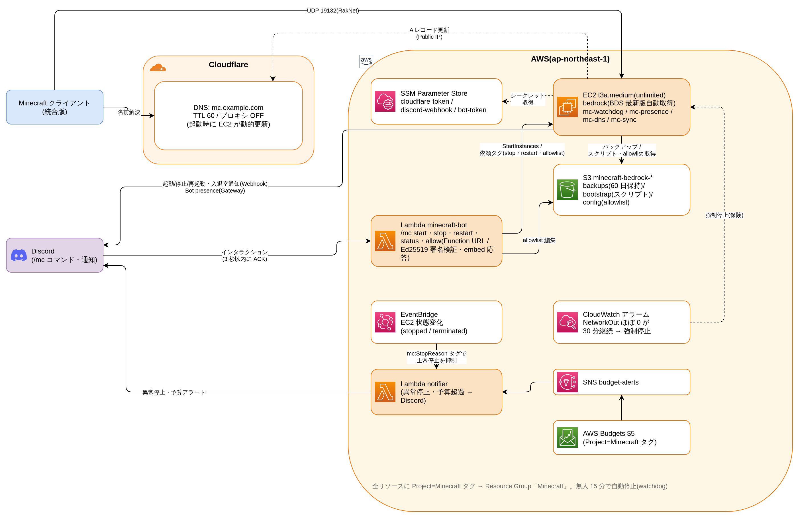

# Minecraft サーバーで学ぶ AWS 入門

[English](README.md) | **日本語**

**「友達と遊ぶ Minecraft サーバー」を題材に、AWS の主要サービスを手を動かしながら学ぶ教材**です。

作るのはただのゲームサーバーではありません。

- Discord で `/mc start` と打つと EC2 が起動し、60〜90 秒で遊べるようになる
- 全員が退出して 15 分経つと、ワールドを S3 にバックアップして**勝手に停止**する
- 止め忘れても、CloudWatch アラームと AWS Budgets が二重三重に見張っている
- 月 40 時間遊んで**約 $4.3/月**(24 時間稼働だと約 $20/月のところを 1/5 に)

つまり「**必要なときだけ動かして、使った分だけ払う**」というクラウドの本質を、
遊びながら体験できる構成になっています。



## この教材で学べること

| サービス | この構成での役割 |
| --- | --- |
| **EC2** | ゲームサーバー本体。AMI・セキュリティグループ・EBS・user_data・IMDSv2 |
| **Lambda** | Discord Bot(常駐サーバーなしで月 $0)。Function URL・非同期呼び出し |
| **IAM** | 最小権限のロール設計。タグ条件で「Minecraft のリソースしか触れない」を実現 |
| **S3** | ワールドのバックアップとスクリプト配布。ライフサイクルルールで自動削除 |
| **SSM** | Parameter Store でシークレット管理、Session Manager で SSH レスのシェル |
| **EventBridge / CloudWatch / SNS** | 異常停止の検知と通知、無人インスタンスの強制停止 |
| **AWS Budgets** | タグ単位の予算監視。「クラウド破産」を防ぐ最後の砦 |
| **Terraform** | 上記すべてをコードで管理(IaC)。`terraform apply` 一発で構築 |

## テキスト(docs/)

| 章 | 内容 |
| --- | --- |
| [00 はじめに](docs/ja/00-intro.md) | 何を作るか・費用・前提知識・安全装置 |
| [01 AWS アカウントの準備](docs/ja/01-aws-account.md) | アカウント作成・IAM・CLI 設定・請求アラート |
| [02 Terraform 入門](docs/ja/02-terraform.md) | IaC とは・init / plan / apply・state・このリポジトリの読み方 |
| [03 EC2](docs/ja/03-ec2.md) | インスタンス・AMI・セキュリティグループ・user_data・EIP を使わない理由 |
| [04 IAM](docs/ja/04-iam.md) | ロール・最小権限・タグ条件・SSM Session Manager |
| [05 S3 と SSM Parameter Store](docs/ja/05-s3-ssm.md) | バックアップ・bootstrap パターン・シークレット管理 |
| [06 Lambda と Discord Bot](docs/ja/06-lambda-discord.md) | Function URL・署名検証・非同期呼び出し |
| [07 監視とコスト管理](docs/ja/07-monitoring.md) | 3 層の障害検知・CloudWatch アラーム・Budgets |
| [08 ハンズオン:構築手順](docs/ja/08-hands-on.md) | 実際に構築して遊ぶ。片付け(destroy)まで |

コードを先に眺めたい人は、各 `.tf` ファイルのコメントが章の要約になっています。

## 必要なもの

- AWS アカウント(無料枠でなくても月数百円で収まる想定。[00 はじめに](docs/ja/00-intro.md) 参照)
- Cloudflare で管理している独自ドメイン(無料プランで OK)
- Discord サーバー(Bot を置く場所)
- Terraform >= 1.13 / Python 3 / AWS CLI

## クイックスタート

すでに AWS と Terraform に慣れている人向けの最短手順です。
初めての人は [08 ハンズオン](docs/ja/08-hands-on.md) を上から順にどうぞ。

```sh
git clone https://github.com/dokkiitech/minecraft-aws-intro.git
cd minecraft-aws-intro

# 1. シークレットを SSM Parameter Store に置く(docs/08 参照)
# 2. Discord アプリを作り、tfvars を埋める
cp minecraft.auto.tfvars.example minecraft.auto.tfvars

# 3. Bot の zip を作って apply
./bot/build.sh
terraform init
terraform apply

# 4. terraform output interactions_endpoint_url を Discord に設定し、
#    bot/register_commands.py でスラッシュコマンドを登録

# 遊び終わったら(全リソース削除)
terraform destroy
```

## コントリビュートとライセンス

[MIT License](LICENSE)。fork して自分のサーバーとして自由に使ってください。
改善の PR・issue も歓迎します。詳しくは [CONTRIBUTING.md](CONTRIBUTING.md) を
参照してください(`main` への直接 push は受け付けていません。fork → PR でお願いします)。

この教材は [dokkiitech/dokkiitech-infra](https://github.com/dokkiitech/dokkiitech-infra) で
実際に運用している構成を汎用化したものです。
