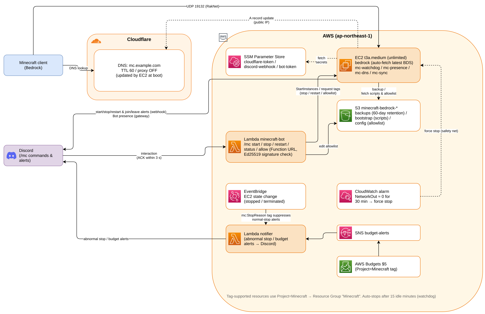

# Learn AWS by Building a Minecraft Server

**English** | [日本語](README.ja.md)

**A hands-on introduction to AWS, using a "Minecraft server for you and your friends" as the teaching material.**

This is not just another game server. What you will build:

- Type `/mc start` in Discord and an EC2 instance boots — ready to play in 60–90 seconds
- When everyone has left for 15 minutes, it backs up the world to S3 and **stops itself**
- Even if auto-stop breaks, a CloudWatch alarm and AWS Budgets are watching in layers
- Roughly **$4.20/month for 40 hours of play** (vs. ~$42/month if it ran 24/7)

In other words, you get to experience the essence of the cloud — **run things only when you
need them and pay only for what you use** — while playing a game.



## What you will learn

| Service | Role in this project |
| --- | --- |
| **EC2** | The game server itself. AMIs, security groups, EBS, user_data, IMDSv2 |
| **Lambda** | The Discord bot ($0/month, no always-on server). Function URLs, async invocation |
| **IAM** | Least-privilege role design. Tag conditions that scope access to this project only |
| **S3** | World backups and script distribution. Lifecycle rules for automatic cleanup |
| **SSM** | Parameter Store for secrets, Session Manager for SSH-less shell access |
| **EventBridge / CloudWatch / SNS** | Failure detection, alerting, and force-stopping idle instances |
| **AWS Budgets** | Per-tag budget monitoring — the last line of defense against surprise bills |
| **Terraform** | Everything above as code (IaC). One `terraform apply` builds it all |

## The text (docs/)

| Chapter | Contents |
| --- | --- |
| [00 Introduction](docs/00-intro.md) | What you'll build, costs, prerequisites, safety nets |
| [01 Setting up your AWS account](docs/01-aws-account.md) | Account creation, IAM, CLI setup, billing alerts |
| [02 Terraform basics](docs/02-terraform.md) | What IaC is, init / plan / apply, state, how to read this repo |
| [03 EC2](docs/03-ec2.md) | Instances, AMIs, security groups, user_data, why no Elastic IP |
| [04 IAM](docs/04-iam.md) | Roles, least privilege, tag conditions, SSM Session Manager |
| [05 S3 and SSM Parameter Store](docs/05-s3-ssm.md) | Backups, the bootstrap pattern, secret management |
| [06 Lambda and the Discord bot](docs/06-lambda-discord.md) | Function URLs, signature verification, async invocation |
| [07 Monitoring and cost control](docs/07-monitoring.md) | 3-layer failure detection, CloudWatch alarms, Budgets |
| [08 Hands-on: build it](docs/08-hands-on.md) | Actually build and play, all the way to teardown (destroy) |

If you prefer reading code first: the comments in each `.tf` file are a summary of the
corresponding chapter (currently in Japanese — translations welcome!).

## What you need

- An AWS account (expect a few dollars a month — see [00 Introduction](docs/00-intro.md))
- A domain managed on Cloudflare (free plan is fine; Route 53 also works, see [03](docs/03-ec2.md))
- A Discord server (a place to put the bot)
- Terraform >= 1.13 / Python 3 with pip / zip / AWS CLI

## Quick start

The shortest path for people already comfortable with AWS and Terraform.
If this is your first time, follow [08 Hands-on](docs/08-hands-on.md) step by step instead.

```sh
git clone https://github.com/dokkiitech/minecraft-aws-intro.git
cd minecraft-aws-intro

# 1. Put secrets in SSM Parameter Store (see docs/08)
# 2. Create a Discord application, then fill in the tfvars
cp minecraft.auto.tfvars.example minecraft.auto.tfvars

# 3. Build the bot zip and apply
./bot/build.sh
terraform init
terraform apply

# 4. Set `terraform output interactions_endpoint_url` in the Discord Developer
#    Portal, then register slash commands with bot/register_commands.py

# When you're done (see docs/08: empty S3 first; delete SSM parameters separately)
terraform destroy
```

## Contributing & license

[MIT License](LICENSE). Fork it and run it as your own server, freely.
Issues and pull requests are welcome — see [CONTRIBUTING.md](CONTRIBUTING.md)
(direct pushes to `main` are not accepted; contribute via fork + PR).

This project is a generalized version of a setup actually operated in
[dokkiitech/dokkiitech-infra](https://github.com/dokkiitech/dokkiitech-infra).
